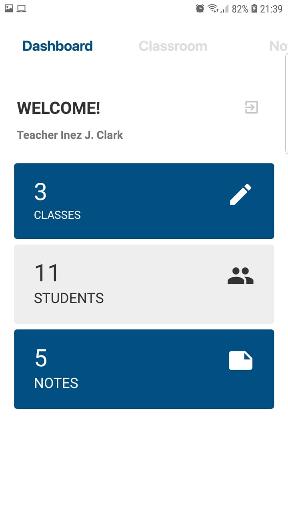
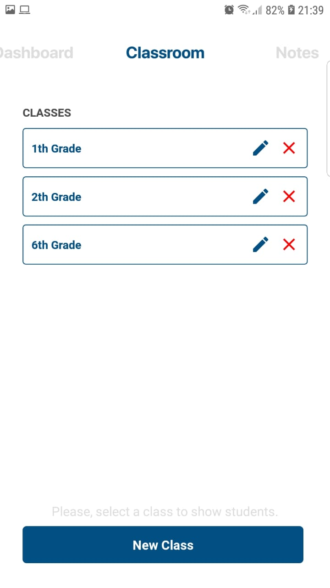
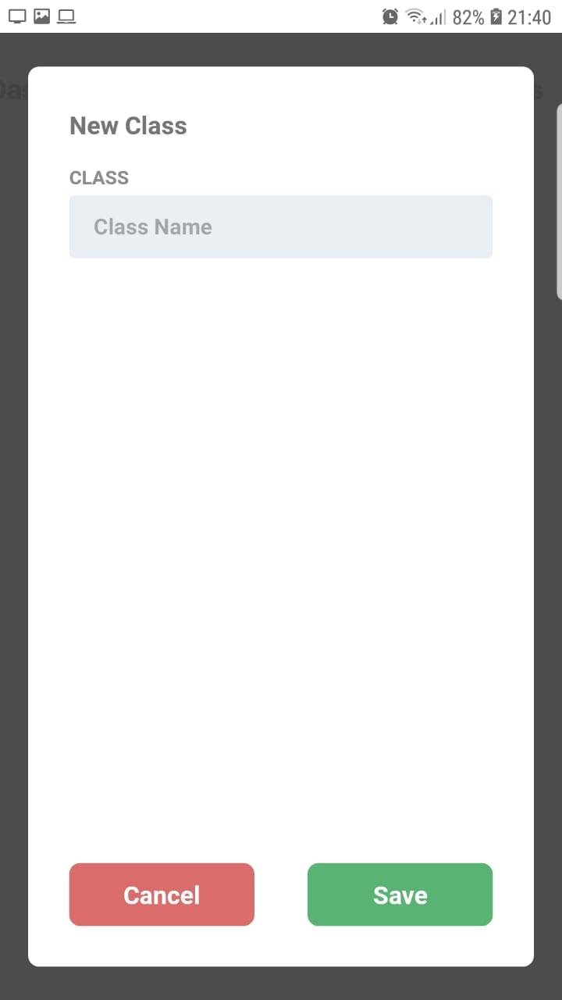
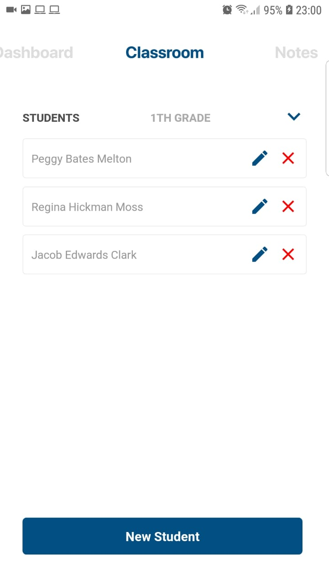
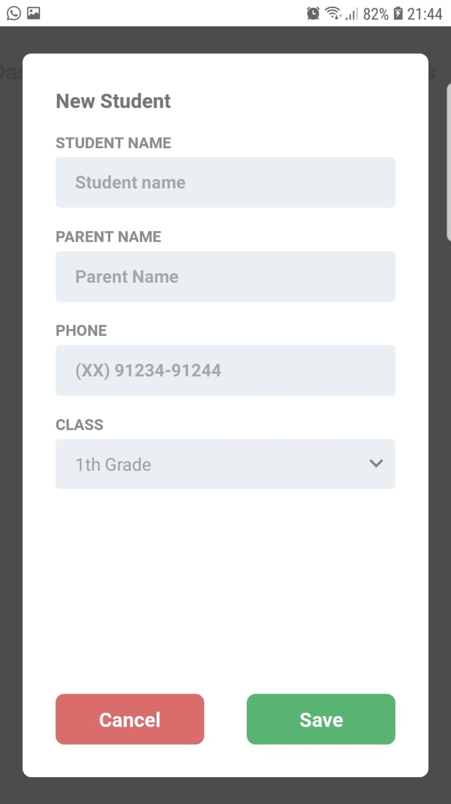
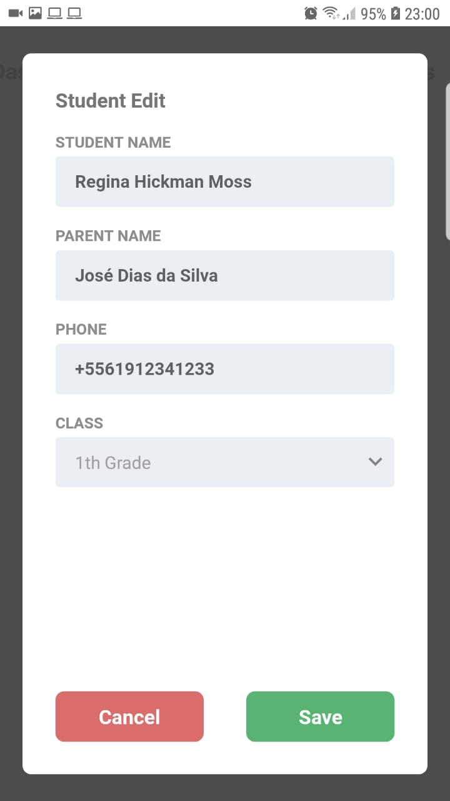
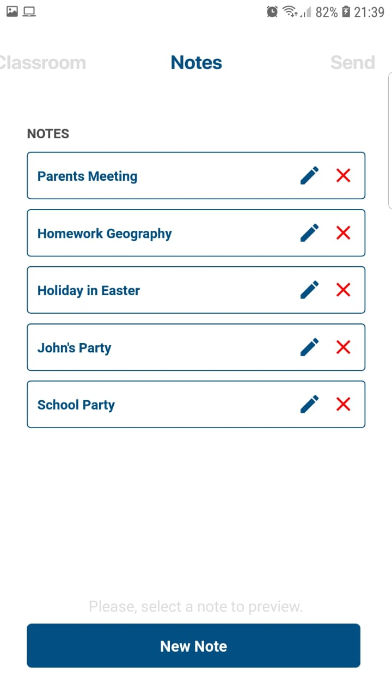
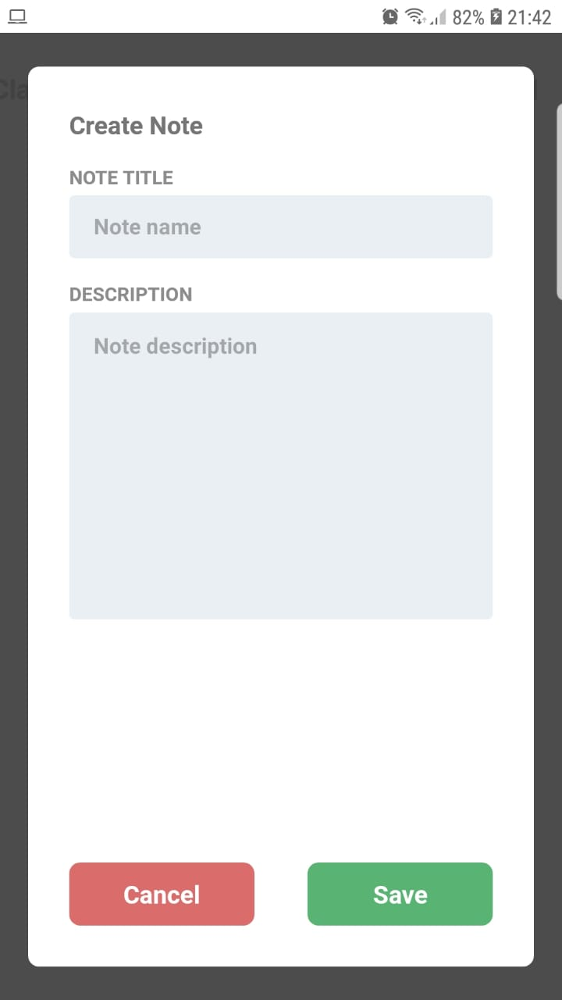
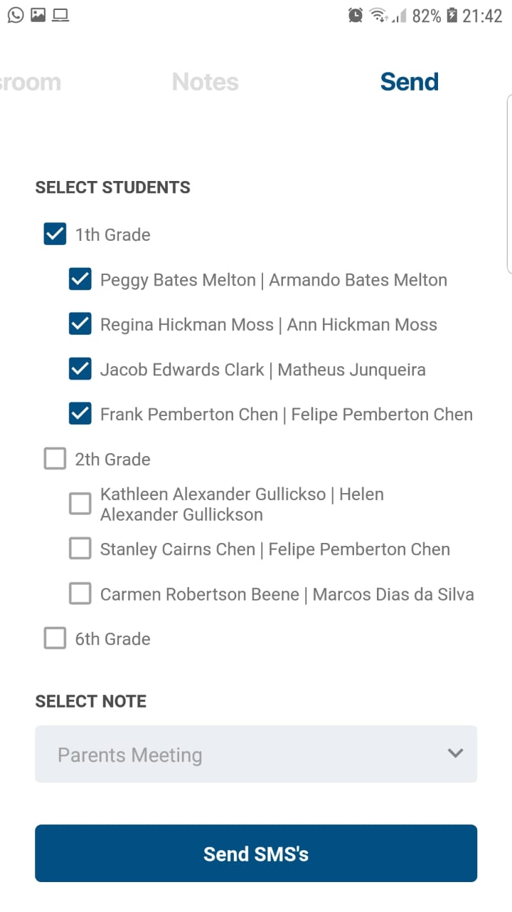

<p align="center">
<a href="#" alt="Gestão Escolar Tech Mobile">
  </a></p>

# Gestão Escolar Tech - Mobile

Aplicativo para acompanhamento de filhos na escola.

Desenvolvido em React Native para o Hackaton da Total Voice 2019 organizado pela Shawee.

## Descrição do Problema

Nosso Aplicativo vem de um problema bem comum entre as escolas: mal desempenho do fillho, a desconexão de pais e escola, a familia não liga ou não pode acompanhar o desempenho do seu filho na escola, as vezes por motivo dele não ter uma pessoa que o oriente ou ate mesmo pela dura realidade da familia ter que trabalhar 8h ou até mais de oito horas para trazer sustento para sua casa.

## A solução

Nossa solução busca aproximar a escola com pais de alunos. Com o aplicativo, a escola poderá comunicar diretamente com os pais e dando total acesso às informações relacionadas a desempenho, notas, e qualquer eventualidade que venha ocorrer. Com isso a interação entre escola e pais é melhorada e a real situação escolar do filho sempre ao alcance dos pais.

## Imagens da Aplicação

Login e Dashboard



Turmas



Estudantes



Bilhetes



Enviar




## Instalação

Instale as dependencias necessárias.
```console
yarn install ou npm install
```

Na raiz do projeto, crie um arquivo .env com o seu ip da seguinte forma.
```console
MY_IP=192.168.xx.xx
```

Para rodar com o servidor local de dados fictícios, instale de forma global o json-server e execute o servidor com o seu ip.

```console
yarn global add json-server
cd src/services
json-server bilheteescolarserver.json -p 3332 -H 192.168.xx.xx
```

## Execução

Na pasta raíz do projeto execute o metro bundler em um terminal.
```console
react-native start --reset-cache
```

Em um outro terminal instale a aplicação.
```console
react-native run-android
```

## Time

- Ricardo Alves
- Leonardo
- Eduardo Quintino
- Espaker
- Felipe

## Licensa

MIT
